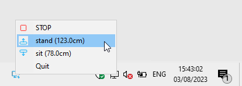

## IDASEN TRAY

Control your IKEA [Idasen](https://www.ikea.com/us/en/p/idasen-desk-sit-stand-black-dark-gray-s79280998/) standing desk from Windows' system tray. This project is built around [idasen-controller](https://github.com/rhyst/idasen-controller) by [rhyst](https://github.com/rhyst).

## REQUIREMENTS

- [Python 3](https://www.python.org/downloads/)
- [Windows Terminal](https://github.com/microsoft/terminal) with a PowerShell 5 profile
- A Bluetooth LE analyser like [Bluetooth LE Lab](https://apps.microsoft.com/store/detail/bluetooth-le-lab/9N6JD37GWZC8) (note this is only needed once to find your desk's MAC address)

## INSTALL

- Download the [latest release](https://github.com/gliptal/idasen-cli/releases/latest).
- Unzip the package.
- Create a Python virtual environment in `idasen-tray`'s directory:

    `python -m venv .venv`

## CONFIGURE

- Pair your PC to your desk via Bluetooth.

- Configure [`idasen_tray/config.bat`](idasen_tray/config.bat):

    | OPTION        | DESCRIPTION                                                                                                                   |
    |---------------|-------------------------------------------------------------------------------------------------------------------------------|
    | `mac_address` | your desk's MAC address: this should never have to be changed once set                                                        |
    | `favourites`  | your desk height settings (see [idasen-controller's configuration](https://github.com/rhyst/idasen-controller#configuration)) |

## USAGE

- Create a shortcut to `scripts/start.bat` and set `Start in` to the package's root folder (the one that contains `scripts`).
- Start Idasen Tray and use the system tray menu to control your Idasen desk.

    

## ACKNOWLEDGMENTS

- [idasen-controller](https://github.com/rhyst/idasen-controller) by [rhyst](https://github.com/rhyst), that actually communicates with the desk.
- [Tabler Icons](https://tablericons.com/) for this project's icon.
